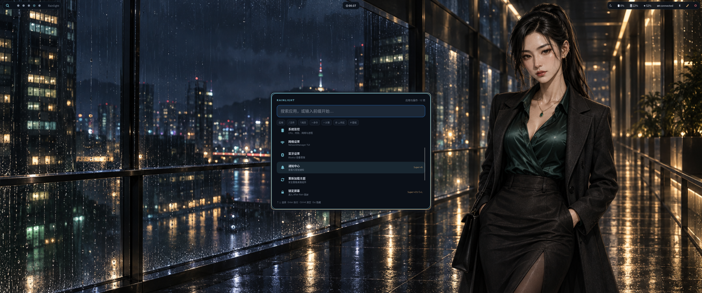

# 雨幕之后 · Hyprland

这是一套面向 Ubuntu 的独立 Hyprland 桌面配置：用《雨幕之后》的成年女性角色素材，
统一雨夜深蓝、青色反光和暖金点缀，并提供可验证、可备份、可回滚的安装流程。

本项目学习了 Omarchy 的主题方法，但不是 Omarchy 的分支，也与 Omarchy、Hyprland
官方无隶属或背书关系。这里保留 Ubuntu 原生 Hyprland/Hyprlang 栈，不照搬
Arch Linux 包管理、Lua 或 Quickshell。

## 特点

- 配置拆分为程序、显示器、环境、输入、外观、布局、规则、快捷键和启动模块
- 全新 **Rainlight** GTK4 搜索面板：应用、文件、网页、命令、计算器、工作区、
  壁纸七种模式，不依赖 Omarchy 运行时
- Super+1 到 Super+4 分别绑定林晚、高森葵、徐知安和 Clara；从 Waybar 或
  手势切换工作区时，后台监听器也会同步专属壁纸
- Waybar、SwayNC、SwayOSD、Wlogout、Hyprlock、Hyprtoolkit、GTK、btop 和
  两种终端都由同一份语义色板生成
- 安装前私密备份，安装失败自动回滚；附带精确恢复、运行诊断、素材哈希/元数据
  校验、密钥扫描和 CI

## 安装

~~~bash
./scripts/install.sh
after-rain-doctor
~~~

安装器会打印备份目录和精确恢复命令。完整说明见
[安装与恢复](docs/INSTALL.zh-CN.md)。架构、主题定制和故障排查分别见
[架构说明](docs/ARCHITECTURE.zh-CN.md)、[主题定制](docs/THEMING.zh-CN.md) 与
[故障排查](docs/TROUBLESHOOTING.zh-CN.md)。

## Rainlight 搜索语法

| 输入 | 功能 |
|---|---|
| 普通文字 | 模糊搜索已安装应用和桌面操作 |
| `/ 名称` | 搜索主目录文件 |
| `? 关键词` | 用默认浏览器网页搜索 |
| `> 命令` | 明确执行 Shell 命令 |
| `= 表达式` | 安全四则运算并可复制结果 |
| `@ 工作区` | 搜索并切换工作区 |
| `# 角色` | 搜索并设置角色壁纸 |

代码/文档采用 MIT；美术资产不跟随 MIT，详见
[ASSETS.md](LICENSES/ASSETS.md)。
