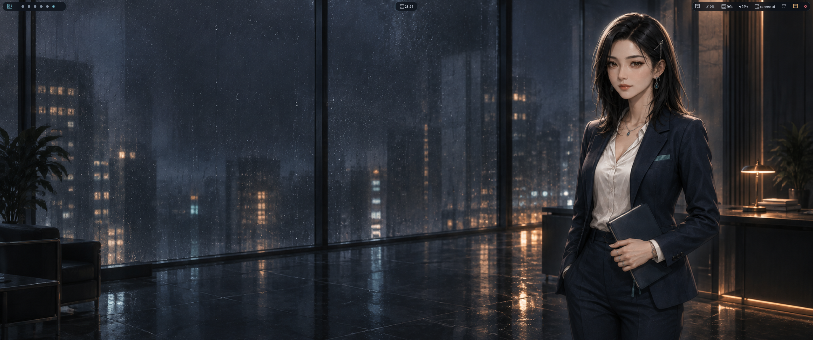

# 雨幕之后 · Hyprland

这是一套面向 Ubuntu 的独立 Hyprland 桌面配置：用《雨幕之后》的成年女性角色素材，
统一雨夜深蓝、青色反光和暖金点缀，并提供可验证、可备份、可回滚的安装流程。

本项目学习了 Omarchy 的主题方法，但不是 Omarchy 的分支，也与 Omarchy、Hyprland
官方无隶属或背书关系。这里保留 Ubuntu 原生 Hyprland/Hyprlang 栈，不照搬
Arch Linux 包管理、Lua 或 Quickshell。

## 特点

- 配置拆分为程序、显示器、环境、输入、外观、布局、规则、快捷键和启动模块
- Super+E 打开 Nautilus；Super+C 和 Super+Q 都能关闭窗口
- Waybar、SwayNC、Hyprlock、终端共用同一套语义色板
- 林晚、高森葵、徐知安、Clara 四组成年女性角色壁纸
- 安装前自动备份，附带恢复、诊断、语法校验与密钥扫描

## 安装

~~~bash
./scripts/install.sh
after-rain-doctor
~~~

安装器会打印备份目录和精确恢复命令。完整说明见
[安装与恢复](docs/INSTALL.zh-CN.md)。

代码/文档采用 MIT；美术资产不跟随 MIT，详见
[ASSETS.md](LICENSES/ASSETS.md)。
