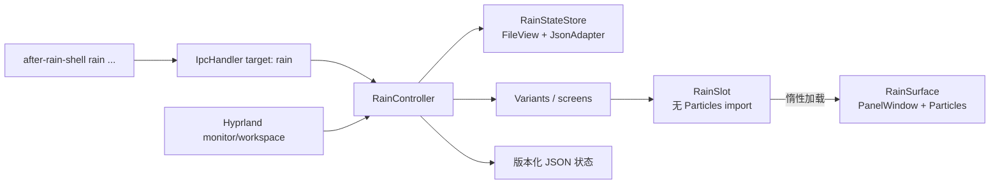

# 雨幕透明层设计

状态：**原始调研记录；实现方案已于 2026-09-30 按用户反馈调整**

当前代码仅启用独立玻璃水珠动画。按用户最终选择，雨丝粒子暂不启用；
`RainStreaks.qml` 保留实现，但当前渲染链不加载、不实例化它。
水珠凝结、停留、拉长后滑落，带局部汇聚表现与淡出水痕；不采集桌面，不提供真实背景折射。
实际组件、命令、限额、验证结果与限制见 [玻璃水珠使用说明](RAIN-EFFECTS.zh-CN.md)。
下文的未实现状态和 GPU 故障是最初调研时的历史记录，性能数字为目标，
不作为当前实现的验收结论。NVIDIA 遥测现已恢复，Shell 实际使用 AMD 核显。

目标版本：After Rain Shell MVP-1

调研与基线日期：2026-09-30

## 1. 决策摘要

在现有 `after-rain` Quickshell 进程中增加一个独立的 `RainController` 模块。模块为
每块已连接屏幕创建一张透明的 Wayland layer-shell 表面，并用
`QtQuick.Particles` 绘制低透明度雨丝。该表面必须满足以下合约：

- 覆盖整块输出，但 **输入区域为空**，鼠标、触摸和键盘全部继续交给下层窗口；
- `surfaceFormat.opaque` 在首次显示前设为 `false`，窗口背景保持透明；
- 使用固定 namespace `after-rain-weather`，不启用 blur、dim 或 `above_lock`；
- 位于 `WlrLayer.Top`，并在该屏幕工作区出现全屏窗口时自动隐藏；
- 关闭或被抑制时停止并销毁粒子，关闭窗口更新，不能只冻结动画；
- 粒子实现惰性加载。缺少 QML 模块、纹理损坏或单屏创建失败时，现有快捷键
  overlay 和 Shell 健康状态仍可继续工作；
- 只持久化用户请求的档位，不持久化全屏、锁屏等临时抑制状态；
- 公开一个很窄的 typed IPC：`setMode`、`toggle`、`status`。不开放任意 QML、命令、
  粒子数量或 shader 参数执行入口。

首版推荐 `QtQuick.Particles`，不使用 `Repeater` 堆出数百个 QML 对象，也不直接上
全屏 fragment shader。Shader 路线保留为性能实测后的替换实现，而不是现在就抽象一套
通用“环境特效框架”。

## 2. 问题与边界

用户所说的“透明层”是一张持续覆盖桌面的视觉表面：窗口和面板仍正常操作，雨丝只负责
显示，不拦截任何输入。它不是壁纸的一部分，因为雨丝需要出现在普通应用窗口上方；也不是
模糊或调暗规则，因为这些规则不能产生运动。

### 2.1 目标

1. 在普通桌面和非全屏应用之上显示低干扰、连续的雨丝。
2. 鼠标点击、滚轮、拖拽、触摸和键盘焦点行为与未启用雨效时相同。
3. 支持多显示器热插拔，每块屏幕按自己的尺寸和全屏状态独立工作。
4. 默认开箱可见，同时提供即时关闭、环境变量熔断和持久化档位。
5. 把多屏、生命周期、持久化、限额和诊断藏进一个深模块，调用侧只理解“模式”。
6. 在当前 3440×1440、约 60 Hz 的实机会话上建立可复现的性能验收门槛。

### 2.2 非目标

- 首版不模拟雨滴折射、窗面水痕、落地飞溅、雷电或音效。
- 不把雨效显示在锁屏之上，也不绕过 session lock。
- 不提供任意数值调参 IPC，不让外部调用者控制发射器内部属性。
- 不承诺 X11、非 Hyprland compositor 或 Qt software renderer 的体验。
- 不在首版建设插件系统、通用特效注册表或多个渲染后端的公共接口。
- 不用第三方视频素材或常驻 `mpvpaper` 进程伪装前景雨效。

## 3. 已验证基线

以下是 2026-09-30 在当前仓库和主机会话中实际检查到的事实，不是目标状态：

| 项目 | 当前事实 | 对设计的影响 |
|---|---|---|
| Shell | Quickshell 0.3.1，Qt 6.10.2 | 按 0.3.1 API 设计，不引用滚动版文档行为 |
| 当前入口 | `shell.qml` 只挂载快捷键 overlay | 雨效必须作为新增模块接入，不能假定已有天气层 |
| IPC | `shell` endpoint 有精确函数白名单测试 | 雨效使用独立 `rain` endpoint，避免改变既有合约含义 |
| QML 模块 | `qml6-module-qtquick-particles` 已安装 | MVP 可直接选 Qt Quick Particles |
| Shader 工具 | 隔离构建目录内有 Qt 6 `qsb` | 将来可评估 shader，但当前不应依赖未安装到稳定路径的工具 |
| 显示器 | `HDMI-A-1`，3440×1440，scale 1，约 60.002 Hz | 首轮性能基线以 16.67 ms 帧预算验收 |
| Hyprland 规则 | 多个 namespace 统一 blur；尚无雨层规则 | 雨层规则必须单列，禁止继承 blur |
| GPU 遥测 | 当前 `nvidia-smi` 无法与驱动通信 | 不能宣称 GPU/功耗达标；修复遥测后才可过性能门 |

当前代码还没有雨效实现。因此“界面没有下雨”不是开关没打开，而是这条功能链尚未落地。

## 4. 资料结论

### 4.1 透明与输入穿透是两个不同条件

Quickshell 的 `QsWindow.mask` 定义可接收点击的区域；空 `Region` 的默认宽高均为 0，
可把 layer surface 的输入区域设为空。另一方面，窗口要真正合成透明内容，
`surfaceFormat.opaque` 必须在第一次可见之前设为 `false`。所以只写
`color: "transparent"` 不足以构成可靠的透明、穿透合约。

参考：

- [Quickshell 0.3.1 `QsWindow`](https://quickshell.org/docs/v0.3.1/types/Quickshell/QsWindow/)
- [Quickshell 0.3.1 `Region`](https://quickshell.org/docs/v0.3.1/types/Quickshell/Region/)

### 4.2 layer-shell 的层级不能代替全屏策略

`wlr-layer-shell` 定义 `background`、`bottom`、`top`、`overlay` 四层。普通窗口通常位于
`bottom` 与 `top` 之间，因此前景雨需要 `top`；`overlay` 主要用于必须盖过全屏窗口的
表面，不符合低干扰目标。同一层内的相对次序没有协议保证，故不能靠创建顺序确保雨层
永远处在某个全屏窗口之下。设计必须读取每块 Hyprland monitor 的 active workspace，
在 `hasFullscreen` 时显式抑制雨层。

参考：

- [wlroots 官方 `wlr-layer-shell` XML](https://gitlab.freedesktop.org/wlroots/wlr-protocols/-/raw/master/unstable/wlr-layer-shell-unstable-v1.xml)
- [wlr-layer-shell 协议](https://wayland.app/protocols/wlr-layer-shell-unstable-v1)
- [Quickshell `WlrLayershell`](https://quickshell.org/docs/v0.3.1/types/Quickshell.Wayland/WlrLayershell/)
- [Quickshell `WlrLayer`](https://quickshell.org/docs/v0.3.0/types/Quickshell.Wayland/WlrLayer/)
- [Quickshell `HyprlandWorkspace.hasFullscreen`](https://quickshell.org/docs/v0.3.0/types/Quickshell.Hyprland/HyprlandWorkspace/)

### 4.3 粒子成本需要由总量封顶，而不是只限制发射率

Qt 的粒子系统由 `ParticleSystem`、`Emitter`、可视化器和可选 Affector 组成。官方性能
建议指出：粒子数量和尺寸直接影响成本；高数量场景应避免 JavaScript 与 Affector；
`maximumEmitted` 应承担硬上限。`running: false` 会清除粒子，而 `paused: true` 只是保留
当前粒子，因此“关闭”必须用前者。

参考：

- [Qt Quick Particles 模块](https://doc.qt.io/qt-6.8/qtquick-particles-qmlmodule.html)
- [ParticleSystem](https://doc.qt.io/qt-6.8/qml-qtquick-particles-particlesystem.html)
- [Emitter](https://doc.qt.io/qt-6/qml-qtquick-particles-emitter.html)
- [ImageParticle](https://doc.qt.io/qt-6/qml-qtquick-particles-imageparticle.html)
- [Qt Quick Particles 性能说明](https://doc.qt.io/qtforpython-6/overviews/qtquick-particles-performance.html)

### 4.4 全屏 shader 不是天然“免费”

Qt 6 的 `ShaderEffect` 需要预编译 `.qsb`，软件后端不支持；全屏 fragment shader 会对
每个覆盖像素执行。它可能用很少的 draw call 生成大量程序化雨丝，但也增加构建、后端兼容、
调试和像素填充成本。因此只有粒子方案在真实机器上不达标时，才进入 shader 原型比较。

参考：

- [Qt 6 `ShaderEffect`](https://doc.qt.io/qt-6/qml-qtquick-shadereffect.html)
- [Qt Shader Tools 与 `qsb`](https://doc.qt.io/qt-6.8/qtshadertools-index.html)
- [Qt Quick 性能建议](https://doc.qt.io/qt-6.8/qtquick-performance.html)

### 4.5 锁屏安全与锁屏省电是两个问题

雨层不设置 Hyprland `above_lock`，合规的 session lock surface 会覆盖它，所以不会把雨效
画到密码界面之上。但这不等于底下的粒子一定停止计算。首版安全门槛是“永不显示在锁屏之
上”；锁屏期间归零渲染成本需要一个经过验证的本地 lock-state adapter，例如消费 logind
的 `Lock`/`Unlock` 信号，或与项目锁屏入口明确集成。这项优化不得在没有运行态验证时写成
已完成。

参考：

- [Quickshell `WlSessionLock`](https://quickshell.org/docs/v0.3.1/types/Quickshell.Wayland/WlSessionLock/)
- [systemd：桌面环境与 logind](https://systemd.io/WRITING_DESKTOP_ENVIRONMENTS/)

## 5. Design It Twice：候选方案

### 5.1 方案 A：普通 QML Item + Repeater

每根雨丝是一个 `Rectangle` 或图片对象，由 `Repeater` 创建，逐个动画位置和透明度。

优点：实现直观，样式容易观察和调整；不额外依赖 Particles API。

缺点：每根雨丝都带 QML 对象、绑定和动画；在大分辨率、多屏和高密度下，CPU 与对象管理
开销随数量上升。还容易把随机数和回收逻辑写进逐帧 JavaScript。

结论：不选。它适合几十个装饰对象，不适合持续的桌面级粒子背景。

### 5.2 方案 B：QtQuick.Particles

每屏一个 `ParticleSystem`，使用一个 `Emitter` 和一个 `ImageParticle`。雨丝是项目自带的
小尺寸 alpha 纹理，速度和角度使用 QML 粒子参数的小范围随机变化，不使用 Affector、
`ItemParticle` 或逐粒子 JavaScript。

优点：当前主机模块已安装；粒子生命周期和批量渲染由 Qt 管理；有 `maximumEmitted` 硬
上限；失活时可以彻底停止并清空。

缺点：需要用实测确定数量上限；不同 Qt/图形后端可能表现不同；素材和尺寸会影响填充率。

结论：**MVP 推荐方案**。这是当前依赖、实现复杂度、可诊断性和视觉目标之间最稳妥的点。

### 5.3 方案 C：全屏 ShaderEffect

在 fragment shader 中程序化生成雨丝，只传入时间、分辨率和少量参数。

优点：对象数量固定，理论上可用少量 draw call 生成大量雨丝；无需纹理粒子对象。

缺点：每个屏幕像素都参与计算；需要稳定的 `qsb` 构建和打包链；软件后端不可用；shader
随机函数、抗锯齿和多 DPI 更难调试；一旦失败容易让整个画面为空。

结论：保留为 v2 的受控实验。只有方案 B 在验收机上超出预算，且 profiling 指向粒子管理
而非像素填充时，才值得做同画质 A/B 测试。

### 5.4 方案 D：视频壁纸、`mpvpaper` 或 compositor shader

视频壁纸位于普通窗口之后，无法满足“应用上方的透明层”；外部前景视频还会多一个常驻
进程和媒体解码链。compositor shader 会把效果施加到整个输出或已有内容上，生命周期与
After Rain Shell 分离，回退和多屏定位也更难局部化。

结论：不选。

## 6. 模块设计

`RainController` 是一个深模块：Interface 只有模式控制和状态查询，Implementation 则吸收
多屏实例、全屏抑制、状态文件、限额、加载失败和生命周期。调用方不需要理解 emitter。



### 6.1 文件布局

```text
config/quickshell/after-rain/
├── Core/
│   ├── RainController.qml
│   └── RainStateStore.qml
├── Effects/
│   ├── RainSlot.qml
│   └── RainSurface.qml
├── Assets/
│   └── rain-streak.png
└── shell.qml

config/hypr/after_rain/rules.lua
bin/after-rain-shell
scripts/test-rain-overlay.py
scripts/test-quickshell-contract.py
```

`RainSlot.qml` 不导入 `QtQuick.Particles`，只根据 controller 判定是否允许 Loader 创建
`RainSurface.qml`。这条 Seam 的价值是故障隔离：缺模块或纹理失败不会阻止 ShellRoot、
快捷键 overlay 和原有 IPC 初始化。这里只有一个 renderer，因此不要再引入
`AbstractWeatherBackend` 一类假想接口。

### 6.2 依赖分类

| 依赖 | 分类 | 处理 |
|---|---|---|
| QtQuick.Particles、Quickshell | 进程内依赖 | 固定兼容版本，启动时 capability check，惰性加载 |
| bundled rain texture | 本地可替换依赖 | 仓库跟踪、许可证声明、安装校验和存在性测试 |
| Hyprland workspace 状态 | 本地 compositor adapter | 仅通过 `Hyprland.monitorFor(screen)` 与 active workspace 读取 |
| 持久化 JSON | 本地可替换依赖 | 原子写；损坏时回退默认值并公开诊断 |
| GPU driver/compositor | 真正外部依赖 | 不能吞掉故障；status 给出降级原因，环境变量可熔断 |

## 7. Interface

保留现有 `IpcHandler target: "shell"` 不变，新增：

```qml
IpcHandler {
    target: "rain"

    function setMode(mode: string): string
    function toggle(): string
    function status(): string
}
```

允许的 mode 只有：

- `off`
- `light`
- `normal`
- `heavy`

`setMode()` 校验枚举后原子更新 `mode`；非 `off` 值同时更新 `lastActiveMode`。
`toggle()` 在 `off` 与 `lastActiveMode` 之间切换。`status()` 返回一行、版本化 JSON 字符串，
因为 Quickshell typed IPC 只支持基础参数和返回值，不能依赖复杂 QML 对象跨进程传输。

参考：[Quickshell `IpcHandler`](https://quickshell.org/docs/v0.3.1/types/Quickshell.Io/IpcHandler/)

建议状态格式：

```json
{
  "schema": 1,
  "requestedMode": "normal",
  "renderer": "qtquick-particles",
  "killSwitch": false,
  "screens": [
    {
      "name": "HDMI-A-1",
      "effective": "running",
      "suppressedBy": [],
      "liveCap": 198
    }
  ],
  "lastError": ""
}
```

命令行适配器随后提供：

```text
after-rain-shell rain status
after-rain-shell rain toggle
after-rain-shell rain off|light|normal|heavy
```

CLI 只翻译参数，不复制状态机。首版不新增全局快捷键，避免占用用户按键；后续可在 Rainlight
或控制中心调用同一 IPC。

## 8. 每屏透明表面合约

下面是结构示意，不是可直接提交的完整实现：

```qml
PanelWindow {
    required property var modelData
    screen: modelData

    color: "transparent"
    surfaceFormat.opaque: false
    mask: Region {}
    exclusionMode: ExclusionMode.Ignore
    exclusiveZone: 0
    visible: controller.screenShouldRender(modelData)
    updatesEnabled: visible

    anchors {
        top: true
        right: true
        bottom: true
        left: true
    }

    WlrLayershell.namespace: "after-rain-weather"
    WlrLayershell.layer: WlrLayer.Top
    WlrLayershell.keyboardFocus: WlrKeyboardFocus.None

    ParticleSystem {
        running: parent.visible
        // Emitter + ImageParticle；总量由 preset 的 liveCap 封顶。
    }
}
```

必须同时有 `mask: Region {}` 与 `WlrKeyboardFocus.None`：前者保证指针/触摸穿透，后者保证
不索取键盘焦点。`ExclusionMode.Ignore` 和 `exclusiveZone: 0` 保证不挤占窗口可用区域。
每屏由 `Variants { model: Quickshell.screens }` 驱动，屏幕热插拔时跟随模型增删实例。

参考：

- [Quickshell 屏幕模型](https://quickshell.org/docs/v0.3.1/types/Quickshell/Quickshell/)
- [Quickshell `Variants`](https://quickshell.org/docs/v0.3.0/types/Quickshell/Variants/)
- [Quickshell `PanelWindow`](https://quickshell.org/docs/v0.3.1/types/Quickshell/PanelWindow/)
- [Quickshell `ExclusionMode`](https://quickshell.org/docs/v0.2.0/types/Quickshell/ExclusionMode/)
- [Quickshell `WlrKeyboardFocus`](https://quickshell.org/docs/v0.2.1/types/Quickshell.Wayland/WlrKeyboardFocus/)

### 8.1 Hyprland layer rule

雨层不能进入现有统一 blur 循环。单独规则只关闭 compositor 动画：

```lua
hl.layer_rule({
    name = "after-rain-weather-no-animation",
    match = { namespace = "after-rain-weather" },
    no_anim = true,
})
```

不设置 `blur`、`dim_around`、`ignore_alpha`、`above_lock` 或不必要的 `order`。后两者尤其不能
被当作全屏顺序修复；全屏由状态机显式抑制。

参考：[Hyprland Layer Rules](https://wiki.hypr.land/configuring/core/rules/window-rules/#layer-rules)

## 9. 状态模型

### 9.1 请求状态与有效状态分离

用户请求是全局 `requestedMode`；实际效果是逐屏派生的 `effectiveState`：

```text
disabled    requestedMode=off
blocked     AFTER_RAIN_EFFECT=off
suppressed  当前屏幕工作区有 fullscreen
unavailable 粒子模块/纹理/表面加载失败
running     其余情况
```

优先级从上到下判定。临时抑制不改写 `requestedMode`，退出全屏后自动恢复。单屏错误只影响该
屏幕；如果所有屏幕都失败，`status()` 仍可用，原有 `shell ping` 仍应返回健康。

| 事件 | requestedMode | 当前屏幕表面 | 粒子系统 |
|---|---|---|---|
| 启动，normal | 不变 | 创建并显示 | `running=true` |
| 切到 off | 写入 off | 隐藏/卸载 | `running=false`，粒子清空 |
| 进入全屏 | 不变 | 该屏隐藏 | `running=false` |
| 退出全屏 | 不变 | 该屏恢复 | 按 preset 重启 |
| 拔掉屏幕 | 不变 | 销毁该实例 | 随实例销毁 |
| 插入屏幕 | 不变 | 创建新实例 | 按该屏尺寸限额 |
| kill switch | 不改持久化 | 全部不加载 | 不创建 renderer |
| renderer 错误 | 不变 | 失败屏不可用 | 错误写入 status |

### 9.2 持久化

使用 `FileView` + `JsonAdapter` 写入 `Quickshell.statePath("rain.json")`：

```json
{
  "schema": 1,
  "mode": "normal",
  "lastActiveMode": "normal"
}
```

`FileView.atomicWrites` 默认启用，保留它。不存在的文件使用 `normal`；无效 JSON、未知 schema
或未知 mode 回退 `normal`，并把具体错误放进 `status.lastError`。`PersistentProperties` 只
保证 Quickshell reload 期间的状态，不适合承担完整进程重启后的用户配置，因此不用于这里。

参考：

- [Quickshell `FileView`](https://quickshell.org/docs/v0.3.0/types/Quickshell.Io/FileView/)
- [Quickshell `JsonAdapter`](https://quickshell.org/docs/v0.2.0/types/Quickshell.Io/JsonAdapter/)

环境变量 `AFTER_RAIN_EFFECT=off` 是最高优先级熔断器：它阻止加载 `RainSurface.qml`，但不
改写用户状态文件。这样驱动异常、升级回归或远程维护时只需重启 user service 即可安全停用。

## 10. 渲染参数与预算

### 10.1 首轮 preset

下表是用于实现与压测的**初始假设**，不是已经通过的性能结论。密度按逻辑像素面积计算，
再受单屏和全局上限约束：

| 模式 | 目标存活数/逻辑 MP | 单屏下限—上限 | 全局上限 | 当前 3440×1440 估算 |
|---|---:|---:|---:|---:|
| light | 20 | 32—128 | 256 | 约 99 |
| normal | 40 | 64—256 | 512 | 约 198 |
| heavy | 70 | 96—448 | 896 | 约 347 |

计算：

```text
logicalMP = screen.width × screen.height / 1,000,000
liveTarget = clamp(round(logicalMP × density), perScreenMin, perScreenMax)
emitRate = liveTarget / averageLifeSpanSeconds
```

多屏总量超过全局上限时，按各屏逻辑面积同比缩减，并保证每个有效屏至少达到该档位下限；
若连下限总和都超过全局上限，则按屏幕面积公平分配，不突破硬上限。

### 10.2 视觉约束

- 使用一张项目自带、尺寸很小的白色 alpha 雨丝纹理，由 `ImageParticle.color` 套用
  `Theme.accent` 附近的冷青灰色；
- alpha 保持低值，避免盖住文本；速度向下并带少量水平偏转；
- 不使用大面积半透明 Rectangle、blur、`ShaderEffectSource` 或粒子阴影；
- MVP 只有一组雨丝；只有视觉验收明确需要纵深，才在同一总量上限内拆成前后两组；
- 素材必须进入 `LICENSES/ASSETS.md`，安装检查要验证文件存在和哈希。

## 11. 性能验收

所有数字都要在实现后重新测量。当前 NVIDIA 遥测不可用，所以设计评审通过不等于性能验收
通过。

### 11.1 测试方法

1. 固定当前 3440×1440、60.002 Hz 输出和同一张静态壁纸。
2. 每个模式预热 30 秒，采样 120 秒；顺序至少做 off → light → normal → heavy → off。
3. 记录 Quickshell CPU、RSS、compositor/render 帧时间、掉帧和 GPU 指标；保留原始数据。
4. 每档至少重复三次，报告中位数和最差一次，不能只贴单次均值。
5. 额外跑浏览器滚动、视频播放、窗口拖动和 workspace 切换，观察交互回归。

### 11.2 通过门槛

在上述 60 Hz 基线下，`normal` 必须满足：

- render-loop p95 ≤ 13.3 ms（刷新间隔的 80%）；p99 ≤ 16.7 ms；
- 120 秒内 compositor 统计的 dropped/missed frames < 1%；
- Quickshell 相对 `off` 的 CPU 中位数增量 ≤ 单个逻辑核的 3 个百分点；
- Quickshell RSS 增量 ≤ 64 MiB；
- GPU 显存增量 ≤ 128 MiB；
- 在可用且校准过的功耗遥测下，GPU 平均功耗增量目标 ≤ 10 W；
- 切到 `off` 或进入全屏后，5 秒内 CPU/RSS 趋势回到接近 off 基线，雨层不再提交可见帧；
- 连续切换 100 次、热插拔显示器和 suspend/resume 后无崩溃、无持续增长的实例或显存。

如果 `normal` 失败，先调低粒子数/尺寸并 profile；不要直接换 shader。只有证据表明瓶颈来自
粒子对象管理，并且同画质 shader 原型显著改善 p95、功耗和稳定性，才批准 renderer 替换。

## 12. 错误处理与诊断

### 12.1 失败策略

- **QML 模块缺失**：Loader 不创建表面，`status()` 为 `unavailable`；Shell 不退出。
- **纹理缺失/解码失败**：该屏失败并记录明确文件路径；不回退为数百个 Rectangle。
- **Hyprland monitor 尚未映射**：该屏保持 suppressed，等待 monitor adapter 就绪。
- **状态文件损坏**：备份/保留坏文件用于诊断，内存回退 `normal`，下一次显式设置再原子写。
- **单屏 surface resources lost**：只重建该屏实例，设置重试次数和退避，避免热循环。
- **未知 IPC mode**：拒绝并返回错误字符串，不修改现有状态。

### 12.2 `after-rain-doctor` 后续检查项

- Quickshell 版本与运行实例；
- `QtQuick.Particles` import probe；
- 雨丝纹理存在、可读、哈希匹配；
- `after-rain-weather` namespace 数量与已连接屏幕数；
- rain IPC 的 JSON schema、requested/effective 状态和 lastError；
- 当前 GPU telemetry 是否可用；不可用要报告“未验证”，不能显示 0。

## 13. 测试设计

### 13.1 静态合约测试

扩展 `scripts/test-quickshell-contract.py`：

- 新增文件必须存在；
- `shell` IPC 函数白名单保持原样，`rain` endpoint 单独精确匹配三项函数；
- namespace 必须固定为 `after-rain-weather`；
- surface 必须包含空 mask、无键盘焦点、透明格式、Top layer 和 Ignore exclusion；
- renderer 必须通过 Loader 引用，`shell.qml` 和 `RainSlot.qml` 不直接 import Particles；
- 禁止 `execDetached`、`eval`、任意命令分发和外部传入粒子参数；
- Hyprland 雨层规则不得出现 blur、dim、above_lock。

### 13.2 运行态测试

`scripts/test-rain-overlay.py` 使用 `qs ipc` 与 `hyprctl -j layers/monitors/workspaces` 验证：

1. `setMode(normal)` 后每个非全屏输出恰有一个 namespace；
2. 用 `wev` 或等价事件观察器置于雨层下方，点击、滚轮、移动和触摸事件仍到达下层；
3. `hyprctl layers` 显示 top layer、零 exclusive zone，不存在键盘占用；
4. 每块屏幕进入/退出全屏时，只抑制/恢复对应实例；
5. mode 与 `lastActiveMode` 跨 service restart 保持；kill switch 不改状态文件；
6. 删除/破坏纹理和临时屏蔽 QML import 时，Shell 的 `ping` 与快捷键 overlay 仍可用；
7. 插拔输出、改变 scale、DPMS off/on、锁屏、suspend/resume 后实例数正确；
8. 100 次 toggle 后无残留 layer、无持续 RSS 增长。

输入穿透测试不能只靠截图：截图能证明透明，不能证明 input region 为空。

## 14. 交付顺序与回滚

### Phase 0：合约和探针

- 先提交静态测试、QML import probe、状态 schema 和无视觉的 controller；
- 默认通过 `AFTER_RAIN_EFFECT=off` 在开发会话中熔断；
- 修复或替代当前不可用的 GPU 遥测。

### Phase 1：单屏 normal

- 实现单 renderer、单组粒子和空输入 region；
- 先在当前 3440×1440 输出完成穿透、全屏和性能验收；
- 对比 off/normal，保留原始测量数据。

### Phase 2：多屏与持久化

- 接入 `Variants`、全局上限、公平分配、热插拔和 per-screen fullscreen；
- 接入原子状态文件与 CLI；
- 跑故障注入和 100 次切换。

### Phase 3：默认启用

- 只有 normal 全部门槛通过后，缺省状态才设为 `normal`；
- 更新安装、验收、故障排查和 release notes；
- 若现场回归，设置 user service 环境变量 `AFTER_RAIN_EFFECT=off` 并重启即可即时回滚，
  不需要删配置或回退整个 Shell。

## 15. 验收清单

- [ ] 普通桌面肉眼可见雨丝，文字仍清晰。
- [ ] 鼠标、触摸和键盘行为与 off 模式一致。
- [ ] 全屏只抑制所在屏幕；退出后自动恢复。
- [ ] 锁屏上不显示雨效，且没有 `above_lock` 规则。
- [ ] off、kill switch、模块缺失均不影响现有快捷键 overlay。
- [ ] 持久化文件损坏有可诊断降级。
- [ ] 单屏和多屏均不突破粒子硬上限。
- [ ] 当前 3440×1440 实机通过第 11 节全部性能门槛。
- [ ] `git diff --check`、静态合约测试和运行态测试全部通过。
- [ ] 文档明确记录实测硬件、Qt/Quickshell 版本、采样方法与原始结果路径。

## 16. 尚待实现阶段回答的问题

1. 当前 NVIDIA 驱动遥测为什么不可用，采用哪一组可信 GPU 指标？
2. `normal` 在真实 60 Hz 会话上的最佳 alpha、纹理尺寸和存活时间是多少？
3. 锁屏时是否需要接 logind adapter 以停止底层模拟，还是现有功耗已经足够低？
4. 多个不同 scale 输出下，按逻辑面积计算能否保持感知密度一致？
5. Quickshell `resourcesLost` 在 DPMS、驱动恢复和 suspend/resume 中的实际触发行为如何？

这些问题必须由原型和运行态测量回答，不能在设计文档里假装已有结论。
